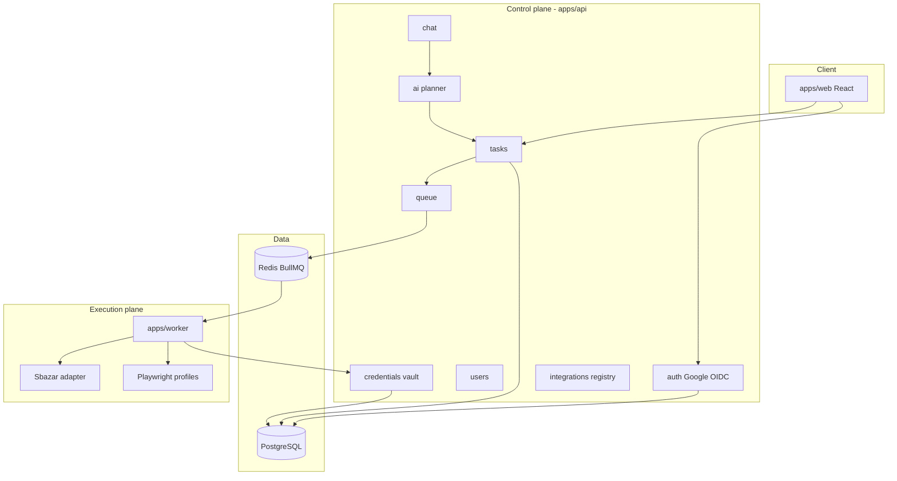

# Architecture

Technical canonical doc for **Max**. Entry point: [../IMPLEMENTATION.md](../IMPLEMENTATION.md).

**Deep dives (read for Phase 0):** [authentication.md](./authentication.md) · [credential-vault.md](./credential-vault.md)

**Decisions:** ADR [0001](./decisions/0001-authentication-google-sso.md) Google SSO · [0002](./decisions/0002-credential-vault-and-worker-handoff.md) credential vault

---

## Pipeline (high level)

```txt
User → React web → NestJS API → AI (Ollama) → validated task JSON
  → user approval → BullMQ → Worker (Playwright) → integration (Sbazar) → site
```

---

## Core principles

1. **AI is not an executor** — planning only (intent → JSON); never clicks, login, or workflows.
2. **Deterministic execution** — Playwright workflows are predefined and testable.
3. **Integration plugins** — Sbazar (MVP), Rohlik (later); each site is an isolated module.
4. **Task-first** — all work is `{ taskType, payload }` validated by Spec Kit / Zod.
5. **Approval before publish** — destructive actions need explicit user confirm.

---

## 1. Two kinds of “auth” (do not conflate)

| Kind                        | Purpose                 | Technology                         | Stored where                                                    |
| --------------------------- | ----------------------- | ---------------------------------- | --------------------------------------------------------------- |
| **Platform identity**       | Who uses Max            | Google SSO → OIDC                  | `users` + session — [authentication.md](./authentication.md)    |
| **Integration credentials** | Worker logs into Sbazar | Password and/or Playwright session | [credential-vault.md](./credential-vault.md) — never sent to AI |

---

## 2. Logical component model



| Component   | Owns                    | Must never                            |
| ----------- | ----------------------- | ------------------------------------- |
| `web`       | UI, OAuth UX            | DB, KEK, Playwright                   |
| `api`       | Users, vault, queue, AI | Playwright, plaintext secrets in logs |
| `worker`    | Playwright, workflows   | AI, KEK, Postgres                     |
| `ai` module | Schema-bound JSON       | Credentials, DOM                      |

---

## 3. Nx monorepo layout

| Path                       | Project     | Responsibility                         |
| -------------------------- | ----------- | -------------------------------------- |
| `apps/web`                 | Application | React + Vite — chat, approval, history |
| `apps/api`                 | Application | NestJS + SWC control plane             |
| `apps/worker`              | Application | BullMQ + Playwright                    |
| `libs/spec-kit`            | Library     | Task schemas, Zod                      |
| `libs/integrations/sbazar` | Library     | Sbazar workflows (MVP)                 |
| `libs/integrations/rohlik` | Library     | Phase 2                                |
| `libs/shared`              | Library     | Shared types                           |

### Import boundaries

| Project          | May import                             | Must not import                      |
| ---------------- | -------------------------------------- | ------------------------------------ |
| `web`            | `shared`                               | `worker`, `integrations`, Playwright |
| `api`            | `spec-kit`, `shared`                   | `worker`, Playwright                 |
| `worker`         | `spec-kit`, `integrations/*`, `shared` | `web`, AI clients                    |
| `spec-kit`       | `shared`                               | apps, integrations                   |
| `integrations/*` | `spec-kit`, `shared`                   | `api`, `web`, AI                     |

### NestJS modules (`apps/api`)

| Module         | Responsibility                   |
| -------------- | -------------------------------- |
| `auth`         | Google OIDC, sessions            |
| `users`        | Profiles (`google_sub`)          |
| `credentials`  | Vault + internal grants          |
| `tasks`        | Task CRUD, status                |
| `chat`         | Messages, AI orchestration entry |
| `ai`           | Ollama/OpenAI → JSON             |
| `queue`        | BullMQ                           |
| `integrations` | Capability registry              |

---

## 4. Platform auth (summary)

Full spec: [authentication.md](./authentication.md).

- OAuth 2.0 + PKCE; API validates `id_token`; httpOnly session cookie.
- Worker uses HMAC service auth only — not Google tokens.

---

## 5. Credentials & worker handoff (summary)

Full spec: [credential-vault.md](./credential-vault.md).

- Envelope encryption in Postgres (API only).
- BullMQ jobs: no secrets.
- Worker: `POST /internal/credential-grants` + HMAC → 60s single-use plaintext.

---

## 6. Data model

| Table                     | Key fields                                                         |
| ------------------------- | ------------------------------------------------------------------ |
| `users`                   | `id`, `google_sub`, `email`                                        |
| `sessions`                | `user_id`, `token_hash`, `expires_at`                              |
| `tasks`                   | `user_id`, `task_type`, `payload_json`, `status`                   |
| `task_runs`               | `task_id`, `status`, `logs_ref`                                    |
| `chat_messages`           | `user_id`, `thread_id`, `role`, `content`                          |
| `integrations`            | `slug`, `capabilities[]`                                           |
| `integration_credentials` | `user_id`, `integration_id`, `ciphertext`, `dek_encrypted`, `kind` |
| `credential_grants`       | `job_id`, `expires_at`, `consumed_at`                              |

---

## 7. Task lifecycle

`Draft` → `PendingApproval` → `Approved` → `Queued` → `Running` → `Succeeded` | `Failed`

User must approve while `PendingApproval`. Worker consumes grant in `Running`.

---

## 8. AI boundary

| In planner prompt           | Allowed |
| --------------------------- | ------- |
| User message, schema docs   | Yes     |
| Passwords, DOM, screenshots | **No**  |

---

## 9. Environment variables

| Variable                                   | App          |
| ------------------------------------------ | ------------ |
| `GOOGLE_CLIENT_ID`, `GOOGLE_CLIENT_SECRET` | API          |
| `SESSION_SECRET`                           | API          |
| `CREDENTIAL_KEK`                           | API only     |
| `WORKER_SERVICE_HMAC_SECRET`               | API + worker |
| `DATABASE_URL`                             | API only     |
| `REDIS_URL`                                | API + worker |

---

## 10. Risks & open items

| Risk             | Mitigation                  |
| ---------------- | --------------------------- |
| Site UI changes  | Versioned integration tests |
| AI bad JSON      | Zod + approval              |
| Credential leak  | Grant model, log redaction  |
| Prompt injection | Schema whitelist            |

| Open              | Notes                                                                           |
| ----------------- | ------------------------------------------------------------------------------- |
| DB                | **PostgreSQL + Prisma** (ADR-0003)                                              |
| Q4 Hosting        | Defer                                                                           |
| Q5 Listing images | Local worker paths for MVP                                                      |
| Q1–Q3             | API prefix, OAuth callback, SSE — see [IMPLEMENTATION.md](../IMPLEMENTATION.md) |

---

## References

- [product-requirements.md](./product-requirements.md)
- [requirements.md](./requirements.md)
- [tech-stack.md](./tech-stack.md)
