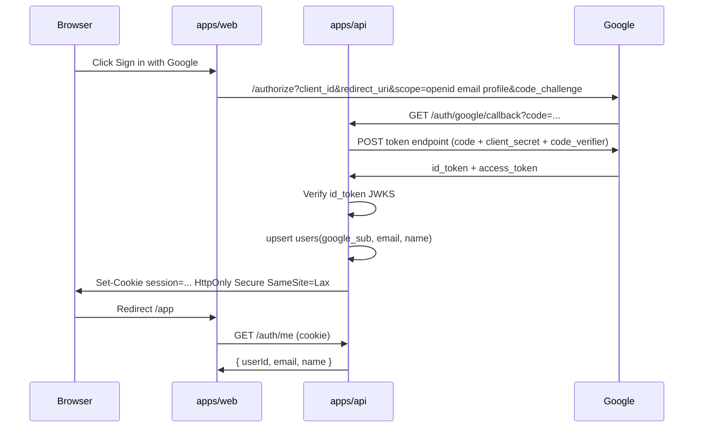

# Authentication — Google SSO

Platform sign-in for **Max**. Integration login (Sbazar, etc.) is separate: [credential-vault.md](./credential-vault.md).

**ADR:** [0001-authentication-google-sso.md](./decisions/0001-authentication-google-sso.md)

---

## 1. Goals

| Goal                           | Approach                               |
| ------------------------------ | -------------------------------------- |
| Low friction sign-up           | Google Single Sign-On (OIDC)           |
| No password management for Max | Google handles credentials             |
| Stable internal user id        | Map Google `sub` → `users.id`          |
| Secure API access              | Server-side session or short-lived JWT |

---

## 2. Technology choices

| Piece            | Choice                                                          | Notes                                                                 |
| ---------------- | --------------------------------------------------------------- | --------------------------------------------------------------------- |
| Protocol         | OAuth 2.0 + OpenID Connect                                      | Google as IdP                                                         |
| Flow             | Authorization Code with **PKCE**                                | Required for SPA/public client safety                                 |
| Token validation | Verify Google `id_token` on API                                 | Never trust client-only parsing                                       |
| NestJS           | `@nestjs/passport` + custom Google strategy, or `openid-client` | Team preference at implement time                                     |
| React            | Redirect to Google; callback route                              | Or `@react-oauth/google` only if tokens forwarded to API for exchange |

**MVP recommendation:** API-owned session cookie (httpOnly), not long-lived access token in browser storage.

---

## 3. Google Cloud setup (checklist)

1. Create project in [Google Cloud Console](https://console.cloud.google.com/).
2. Configure **OAuth consent screen** (External or Internal).
3. Create **OAuth 2.0 Client ID** — type **Web application**.
4. **Authorized JavaScript origins:** `http://localhost:4200` (Nx web dev), production URL later.
5. **Authorized redirect URIs:**
   - `http://localhost:4200/auth/callback` (if web handles redirect)
   - `http://localhost:3000/api/auth/google/callback` (if API handles redirect)
6. Store `GOOGLE_CLIENT_ID` and `GOOGLE_CLIENT_SECRET` in API environment only.

Pick **one** callback owner (web or API) and document in repo `.env.example` — recommended: **API callback** so secret stays server-side.

---

## 4. Sequence (API callback — recommended)



### Scopes (minimum)

- `openid`
- `email`
- `profile`

Do not request Gmail or Drive scopes.

---

## 5. API surface (proposed)

| Method | Path                    | Auth    | Description                                  |
| ------ | ----------------------- | ------- | -------------------------------------------- |
| GET    | `/auth/google`          | Public  | Redirect to Google (or return auth URL JSON) |
| GET    | `/auth/google/callback` | Public  | Exchange code, create session                |
| POST   | `/auth/logout`          | Session | Invalidate session                           |
| GET    | `/auth/me`              | Session | Current user profile                         |

All product routes (`/tasks`, `/chat`, `/credentials`) require valid session → `user_id` on request context.

---

## 6. Session model (MVP)

| Approach                                       | Pros                            | Cons                             |
| ---------------------------------------------- | ------------------------------- | -------------------------------- |
| **DB session + httpOnly cookie** (recommended) | Revocable, simple, no JWT in JS | Requires session store           |
| JWT in memory + refresh                        | Stateless API                   | Harder revoke; XSS if mishandled |

**Recommended schema:**

```sql
sessions (
  id uuid PRIMARY KEY,
  user_id uuid NOT NULL REFERENCES users(id),
  token_hash text NOT NULL,
  expires_at timestamptz NOT NULL,
  created_at timestamptz NOT NULL
)
```

Cookie value: random 32+ bytes; store only `hash(cookie)` in DB.

**TTL:** 7 days sliding refresh on activity (tune in Phase 1).

---

## 7. User record

```sql
users (
  id uuid PRIMARY KEY,
  google_sub text UNIQUE NOT NULL,
  email text NOT NULL,
  display_name text,
  avatar_url text,
  created_at timestamptz NOT NULL,
  last_login_at timestamptz
)
```

- `google_sub` is the immutable link to Google account.
- Email may change on Google side — update on each login, do not use email alone as primary key.

---

## 8. Authorization (not authentication)

| Rule                                       | Enforcement                                                     |
| ------------------------------------------ | --------------------------------------------------------------- |
| User sees only own tasks                   | `WHERE user_id = :currentUser`                                  |
| User sees only own integration credentials | Same                                                            |
| Worker is not a human user                 | Service HMAC — see [credential-vault.md](./credential-vault.md) |

No role-based admin in MVP.

---

## 9. Web app integration

| Concern                | Guidance                                                     |
| ---------------------- | ------------------------------------------------------------ |
| Unauthenticated routes | `/`, `/login`, `/auth/callback`                              |
| Protected routes       | `/app/*` — redirect to login if `GET /auth/me` 401           |
| API client             | `fetch(..., { credentials: 'include' })` for cookie sessions |
| CORS                   | API allows web origin with `credentials: true`               |

---

## 10. Security checklist

- [ ] PKCE on authorization request
- [ ] Validate `id_token` `aud` matches client ID
- [ ] Validate `iss` is `accounts.google.com` or `https://accounts.google.com`
- [ ] Reject expired tokens
- [ ] httpOnly + Secure cookies in production
- [ ] CSRF: SameSite=Lax + state parameter on OAuth start
- [ ] Rate-limit auth endpoints

---

## 11. What Google SSO does _not_ do

- Does not store Sbazar/Rohlik passwords
- Does not replace worker integration login
- Does not grant AI access to any secrets

---

## References

- [architecture.md](./architecture.md)
- [credential-vault.md](./credential-vault.md)
- [Google OpenID Connect docs](https://developers.google.com/identity/openid-connect/openid-connect)
