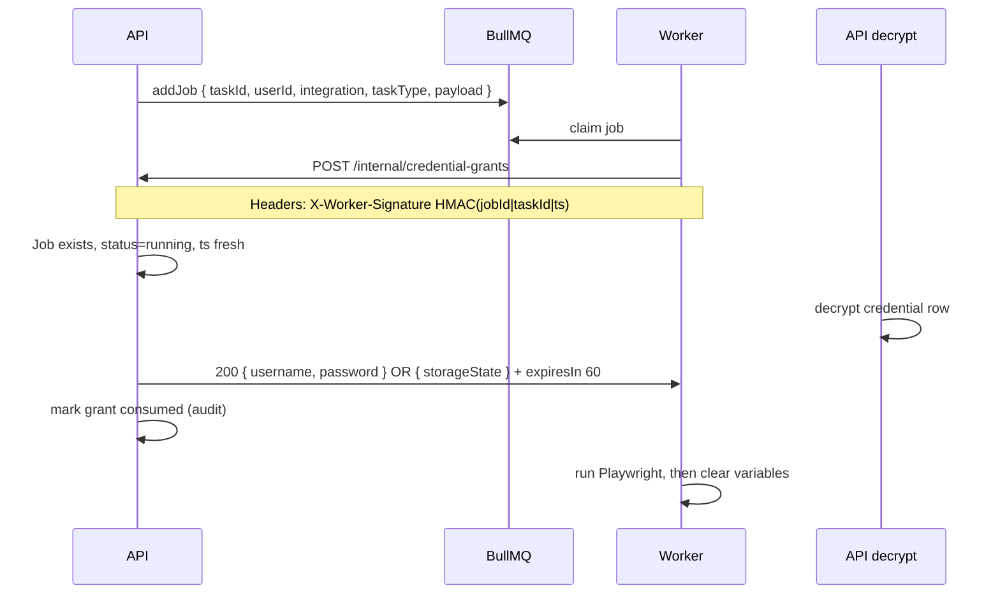

# Credential vault & worker handoff

How **integration secrets** (Sbazar login, browser sessions) are stored and how the **worker** receives them at run time—without exposing them to AI, Redis job payloads, or worker database access.

**ADR:** [0002-credential-vault-and-worker-handoff.md](./decisions/0002-credential-vault-and-worker-handoff.md)

Platform login (Google) is separate: [authentication.md](./authentication.md).

---

## 1. Problem

The worker must log into Sbazar (and later Rohlik) as the **end user**, but:

| Requirement                         | Implication                                 |
| ----------------------------------- | ------------------------------------------- |
| AI must not see secrets             | Secrets never in planner prompts            |
| Worker must not hold master keys    | No `CREDENTIAL_KEK` in worker env           |
| Queue should not leak secrets       | BullMQ job = task metadata only             |
| Sessions should reuse when possible | Persist Playwright state encrypted          |
| Compromised worker is bounded       | Short-lived, single-use credential exposure |

---

## 2. Recommended model (decision summary)

**Envelope encryption in PostgreSQL (API only)** + **job-scoped credential grant (internal API)** + **optional encrypted Playwright `storageState`**.

This is the default for Max unless an ADR supersedes it.

---

## 3. Credential types

| Kind            | `kind` field                             | When to use                                       |
| --------------- | ---------------------------------------- | ------------------------------------------------- |
| `password`      | Username + password JSON encrypted       | User supplies Sbazar credentials in settings      |
| `storage_state` | Playwright `storageState` JSON encrypted | After successful login; preferred for repeat runs |

Both can coexist per `user_id` + `integration_id`; worker prefers `storage_state` if present and not expired, else `password`.

---

## 4. Encryption design (envelope)

Only **API** encrypts and decrypts.

```txt
KEK (Key Encryption Key)     → 32 bytes from env/KMS, versioned
DEK (Data Encryption Key)    → random per credential row
Plaintext                    → JSON { username, password } or storageState

Store in DB:
  dek_encrypted  = AES-256-GCM(DEK, KEK)
  ciphertext     = AES-256-GCM(plaintext, DEK)
  key_version    = int (for KEK rotation)
```

| Field           | Description                         |
| --------------- | ----------------------------------- |
| `ciphertext`    | Encrypted payload                   |
| `dek_encrypted` | Encrypted DEK                       |
| `key_version`   | Which KEK version encrypted the DEK |
| `algorithm`     | `AES-256-GCM` (document in ADR)     |

**Rotation:** New KEK version decrypts old rows on read (re-encrypt on update) — Phase 1.

**Never:** Store plaintext in Postgres, Redis, BullMQ, logs, or Sentry.

---

## 5. Worker handoff — job-scoped grant (recommended)

### Why not put secrets in the BullMQ job?

Redis is often persisted, replicated, and visible to more services than the vault. Job payloads should be replay-safe to inspect.

### Flow



### Grant endpoint rules

| Rule           | Value                                                    |
| -------------- | -------------------------------------------------------- |
| Authentication | HMAC-SHA256 shared secret (`WORKER_SERVICE_HMAC_SECRET`) |
| Payload signed | `jobId`, `taskId`, `timestamp` (max 30s skew)            |
| Response TTL   | Credentials valid for one run; suggest 60s               |
| Single use     | Second request with same job → 409                       |
| Audit          | `credential_grants` table: who, when, job_id             |

### Worker implementation sketch

```typescript
// Pseudocode — not production code
const grant = await apiClient.fetchCredentialGrant({ jobId, taskId });
try {
  await runSbazarWorkflow(playwright, grant);
} finally {
  grant.zero(); // overwrite references
}
```

---

## 6. Playwright session persistence

Per user + integration, store encrypted `storageState` after successful login.

| Path                       | Detail                                                                           |
| -------------------------- | -------------------------------------------------------------------------------- |
| Directory (worker local)   | `profiles/{userId}/{integrationSlug}/` — chromium user data (optional)           |
| Authoritative session blob | Encrypted `storage_state` in vault (API)                                         |
| On run start               | Worker applies `storageState` to `browser.newContext({ storageState })`          |
| On run end (success)       | Worker exports updated state → `POST /internal/storage-state` (encrypted by API) |

**Phase 0 shortcut:** User completes one manual login in headed browser; worker saves state back to API. Avoids storing password in Week 1 if UX allows.

**Phase 1:** Full settings UI + password vault + automatic state refresh.

---

## 7. User-facing flows

### A. Connect Sbazar with username/password

1. User authenticated via Google SSO.
2. Settings → Integrations → Sbazar → enter credentials.
3. API validates format → encrypt → save row.
4. Optional: enqueue **test connection** task (no publish).

### B. Connect Sbazar with guided browser login (MVP-friendly)

1. User clicks “Log in to Sbazar”.
2. API enqueues `sbazar.establishSession` (internal task type).
3. Worker opens **headed** or user-assisted context; user completes login in browser window.
4. Worker uploads `storageState` to API (encrypted).
5. Future listing tasks use session only.

### C. Run listing task

1. User approves `sbazar.createListing` payload.
2. API enqueues job (no secrets).
3. Worker grants → login if needed → workflow → publish.

---

## 8. Alternatives considered

| Approach                               | Verdict                                                   |
| -------------------------------------- | --------------------------------------------------------- |
| Secrets in BullMQ job (encrypted blob) | Rejected — Redis exposure, replay risk                    |
| Worker reads Postgres directly         | Rejected — DB creds in worker widen blast radius          |
| HashiCorp Vault / cloud KMS only       | Valid for production later; envelope + env KEK OK for MVP |
| Password only, no storageState         | Weak UX; session reuse is a product requirement           |
| AI fills login forms                   | Rejected — violates core principles                       |

---

## 9. Phased rollout (aligned with agile plan)

| Sprint phase | Deliverable                                                                                                  |
| ------------ | ------------------------------------------------------------------------------------------------------------ |
| **Phase 0**  | Grant endpoint contract; optional `storage_state` from guided login; minimal `integration_credentials` table |
| **Phase 1**  | Full password vault UI; KEK rotation plan; retry + session expiry detection                                  |
| **Phase 2+** | Rohlik rows same schema; per-integration credential `kind` metadata                                          |

---

## 10. Failure modes

| Symptom         | Handling                                                                                   |
| --------------- | ------------------------------------------------------------------------------------------ |
| Grant expired   | Worker fails job; user retries                                                             |
| Invalid session | Integration detects redirect to login → fail with `SESSION_EXPIRED` → UI prompts reconnect |
| Decrypt failure | API alert; job not started                                                                 |
| HMAC invalid    | 401; log possible intrusion                                                                |

---

## 11. Logging & observability

| Allowed in logs                                 | Forbidden                                   |
| ----------------------------------------------- | ------------------------------------------- |
| `userId`, `integrationSlug`, `jobId`, `grantId` | Passwords, `storageState` cookies, JWT, KEK |
| “Credential grant issued”                       | Decrypted payload                           |

---

## 12. API modules (NestJS)

| Module                 | Responsibility                                   |
| ---------------------- | ------------------------------------------------ |
| `credentials`          | CRUD encrypted rows (user-facing)                |
| `credentials/internal` | Grants + storage-state upload (worker HMAC only) |

`integrations` module exposes which sites user has connected (boolean + last verified_at), never raw secrets.

---

## References

- [architecture.md](./architecture.md)
- [authentication.md](./authentication.md)
- [ADR-0002](./decisions/0002-credential-vault-and-worker-handoff.md)
